# What is a Linked List

A linked list is a structure used for storing a collection of data that has the following properties:

- Successive elements are connected with a pointer (*not necessarily contiguous memory*)
- The last element points to `nothing`
- They grow and shrink during the execution of the program (*mutable*)
- Can be made as long as required (memory bound)

# Abstract Data Type

## Main Operations
- **Insert**: insert an element to the list
- **Delete**: delete an element from the list

## Auxiliary Operations
- *Delete List*: delete the list and all its elements
- *Count*: give the length of the list
- *Find nth node from the end of the list*


# Difference with Array (SArray in Julia)

Array elements are **contoguous in memory** and can be accessed in constant time (given the pointer at the beginning and the length of each element, you just need to read `n*size(typeof(element))` and move the pointer)

## Advantages
- Read and Write element in O(1)
- Easy to use
- Deletion and insertion at ending is easy (if the array is not full)
## Disadvantages
- **Fixed size**: once the memory is allocated that's the size of the array
- **Block allocation**: need to find the space
- **Waste of space**: if you only use part of the array
- **Complex position based insetion**: If the array is smaller than its maximum size and I wand to insert or remove an element at a certain position, I need to move ALL the other elements coming after (expensive at worst O(N) if it's at the beginning)

# Difference with Dynamic Arrays (is it the impremelentation of Array in Julia? Not sure)
Also knows as **array lists**, they are similar to static arrays, but when one finishes, I can allocate a new chunck of memory and linking it. 

Something in between lists and arrays


# Linked Lists
## Advantages
- Can insert an element in O(1): 
   - Create a new element at new_ptr
   -  Get tmp -> old_ptr 
   -  Change olt_ptr-> new_ptr
   - Point my new object to new_ptr
- I can easily make a linked list of different elements
## Disagvantages
- Reaching any point except the beginning can take O(N) (thus for insertion I need to take that into account)


## Single Linked List

### Traverse: 
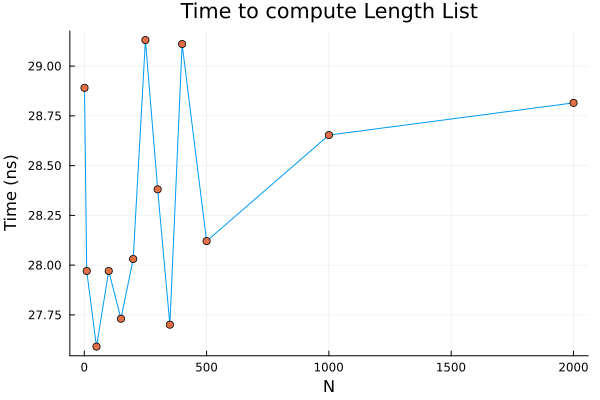
To traverse it I neeto to get all the elements in the list until I hit `Nothing` (see `ListLength`)
    
* Time Complexity: O(N) [to traverse while counting]
* Space Complexity: O(1) [to allocate counter]

### Insert Node:
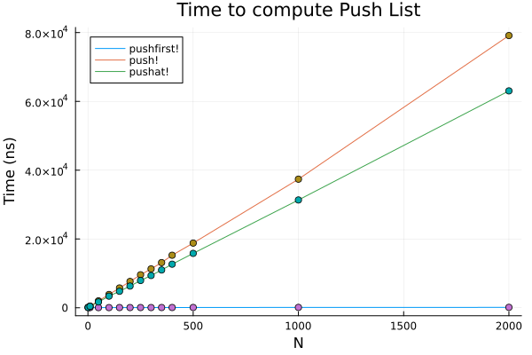
#### Insert at the beginning (`pushfirst!`)
- Create new element `new_node`
- Make new_node point at `head`
- Substitute pointed to `head` to pointer to `new_node`

* Time Complexity: O(1)
* Space Complexity: O(1)


#### Insert at the end (`push!`)
- Create new element `new_node`
- Travel to the end (O(N))
- Modify last pointed to `nothing` -> `new_node`

* Time Complexity: O(N)
* Space Complexity: O(1)

#### Insert in the middle (`pushat!`)
- Create new element `new_node`
- Travel to `n-1` nodes 
- copy pointer of `n-1` in `tmp`
- change pointer of `n-1`->`new_pointer`
- Point new pointer to tmp

* Time Complexity: O(N)
* Space Complexity: O(1)


### Delete Node
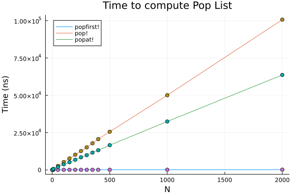

### Delete at the beginning (`popfirst!`)
- new_head= next(head)
- list.head=new_head
- no need to get rid of the node: **garbage collection**

* Time Complexity: O(1)
* Space Complexity: O(1)

### Delete at the end (`pop!`)
- Create new element `new_node`
- Travel to the end-1 O(N)
- Set `end-1` node.next to `nothing
- garbage collection

* Time Complexity: O(N)
* Space Complexity: O(1)

### Delete in the middle
- Create new element `new_node`
- Travel to `i-1` node (up to O(N))
- set new_node.next-> i-1 node.next
- set i-2 node.next -> new_node

* Time Complexity: O(N)
* Space Complexity: O(1)


## Doubly Linked Lists
It has the same complexity of operations, but travelling through the system is easier.

### Advantages
It can run in both ways, so I do not need to repeat the lookup of the list if I need to find the predecessor of a node. Also we don't need to know both next and previous to delete an element
### Disadvantages
- It requires more memory for each element (I need to store also the previous pointer)
- Makes the operation of adding and removing a bit more complex cause I need to change two pointers instead of one
### Traverse


* Time Complexity: O(N)
* Space Complexity: O(1)
### Insert


* Time Complexity: O(N) \[O(1) for pushfirst!\]
* Space Complexity: O(1)
### Delete 

* Time Complexity: O(N) \[O(1) for popfirst!\]
* Space Complexity: O(1)

## Circular Linked Lists
The circular linked list is accessible by the head. Traversing stops when you reach the head again. All the functions are the same of the non circulat case, but we need to remember that the last element loops.

!!! note
   A technical advantage for a double circular linked list is that I can travel in half the time if the length is known a priori if i>L/2 I can travel backward to `end-i+1` otherwise I can travel forward.

   This is hampered by the fast that I would need, for every linked list to store the current length in the structure, since computing the length would still require N operations (next(head)/2+prev(tail)/2)

!! note "Prectical Uses"
   A practical use of a circular double linked list is to implement stacks and queues, since the first and last element are easily accessible in O(1)

### Traverse
If we use `!isnothing(next(node))` the function would go in an infinite loop. Thus, we need to stop when the function returns to the head.
```julia
node=head=list[1]
while !isnothing(node)
   node=next(node)
   node===head && break # circular condition
end
```
#### Single
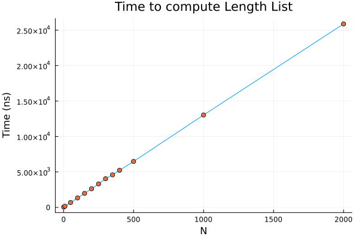
#### Double
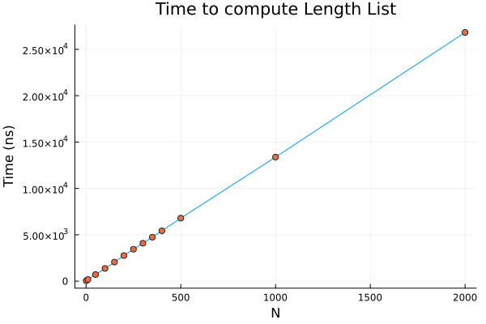

* Time Complexity: O(N) 
* Space Complexity: O(1)
### Insert & Delete
`pushat!` and `popat!` would remain the same for all lists, but we need to modify `push!`,`pushfirst!`,`pop!` and `popfirst` to take into account the connection between the first and the last element

#### Single Insertion and Delition

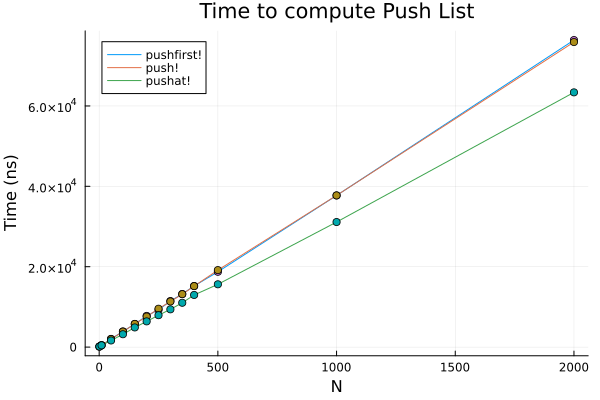
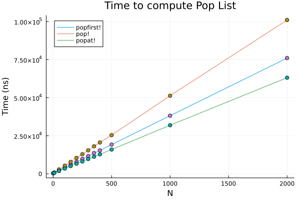
A Single Circular linked list has time complexity O(N) for all operations, since you need to traverse the entire list to get the tail
* Time Complexity: O(N)
#### Double Insertion and Delition
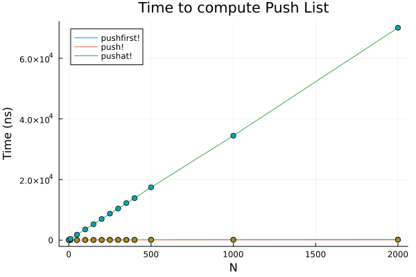

A Double Circular linked list has time complexity O(1) for both `push!` and `pushfirst!` (`pop!` and `popfirst!`) since to get to the tail I can simply use `prev(head)`. The `pushat!` and `popat!` have still O(N) complexity

## Efficient implementation of Length
It is possible to implement length by adding an additional attribute to the linked list

```julia
mutable struct LinkedList{T,NL}
   head::NL{T}
   _length::UInt
end
```
In this way, the _length of the list is defined at construction and it is updated every time I push or pop an element, making the complexity O(1). Thus, accessing all elements in the list becomes faster
### Single Linked List
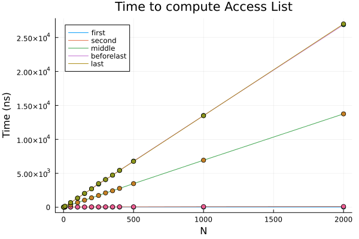
### Double Linked List
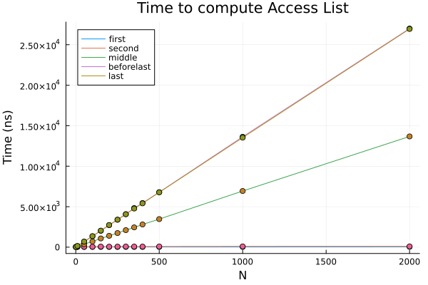
### Circular Single Linked List

### Circular Double Linked List
Circular Double Linked List is a particular case, since now accessing both the initial and the final element has complexity O(1)
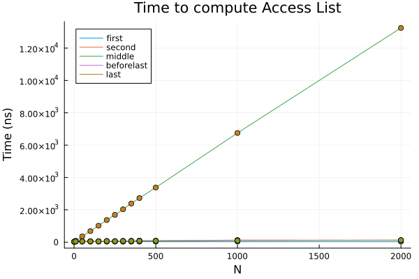


## Efficient implementation of a Double linked list
In general, I need to specify both the `next` node and the `prev` node, making the implementation of a double linked list taking more memory of a single linked list

However, using pointer operations I can store the difference between the memory addresses so that I can store the information in a single operator.

```julia
mutable struct DoubleEfficientNode{T}
   value::T
   ptrdiff::UInt  # Or Ptr but UInt is easier
end
DoubleEfficientNode(value::T) where T =DoubleEfficientNode{T}(value,UInt(0)) #point to C_NULL

LinkedList{Int,DoubleEfficientNode}(xarr::Array{T}) = begin
   value=xarray[firstindex(xarray)]
   node=DoubleEfficientNode(value)
   ptr_prev=UInt(0)
   for i in firstindex(xarray)+1 : lastindex(xarray)
      node_new=DoubleEfficientNode(xarray[i])
      ptr_new=UInt(pointer_from_objref(node_new)) #new_ptr
      node.ptrdiff=xor(ptr_new,ptr_prev) # old_ptr xor 
      ptr_prev=UInt(pointer_from_objref(node)) 
      node=node_new
   end
   node.ptrdiff= ptr_prev # xor (ptr_prev,0)
end
```
Assuming we have a linked list like

Null-A-B-C-...-END-Null

- B=xor(A,Null)
- C=xor(A,C) xor A -> moving forward
- A=xor(A,C) xor C -> moving backward

!! note
   If we want to make it circular, we need to store the pointer to the tail and the head in the linked list, otherwise it wouldn't work, however, all other nodes will only have one pointer


## Unrolled Linked Lists

It is possible to get some of the advantages of the linked lists by mixing them with arrays, by creating a linked list that instead of containing single elements, it contains arrays. 
Thus, traversing each chunk would only take O(1) (like an array), also I am not forced to have contiguous memory for a large array, and locally I can push and pop with the same complexity of a linked list.

!! note
   An unrolled linked list IS NOT a dynamic array. I can create a list where each element is as big as cache line, so that I can load directly in memory my elements

- each block is kept of the size of the cache line
- inside each block I try to keep the capacity to 3/4 (not full), thus I can easily push and pull elements.
- when an array gets too full, I move its content.

### Overhead
Each node has:
   - pointer to next block (single) and previous block (double)
   - Int containing the MaxSize of the block
   - A pre allocated static array of size MaxSize

```julia
abstract type AbstractBlockNode{T,N::Int} <:AbstractListNode{T}
mutable struct SingleBlockNode{T,N}<:AbstractBlockNode
   value::StaticArray{T,1}
   next::SingleBlockNode{T,N}
   _current_idx::Int
end

# Update Scalar
SingleBlockNode(value::T,next=nothing;MaxSize=4) where T = begin
   vec=StaticVector{T}(undef,MaxSize);
   vec[1]=value
   return SingleBlockNode{T,MaxSize}(vec,next,_current_idx=1)
end

# Update Vector
SingleBlockNode(value::AbstractVector{T},next=nothing;MaxSize=4,filling=3/4) where T = begin
   @assert(MaxSize>2,"MaxSize has to be greater than 2")
   @assert(0<filling<=1,"filling has to be between 0 and 1")
   real_filling=min(max(1,round(MaxSize*filling)),length(value))
   

   if length(value)>real_filling
      ptr = SingleBlockNode(value[real_filling+1:end];MaxSize=MaxSize,filling=filling);
   end
   vec=StaticVector{T}(undex,MaxSize)
   vec[1:real_filling]=value[1:real_filling]

   return SingleBlockNode{T,MaxSize}(vec,ptr,real_filling)
end
```


# Traverse the list
If I want to look at the kth element:

1. Find the list of interest: `(l,i)=divrem(k,real_filling)`
2. Go to list `l+1` (0 indexed) O(m/N)
3. Go to element `i` (O(m))

# Inserting
Insertion is a bit more complex than normal lists. Since I want to keep the number of elements constant and I require to shift all other blocks content to keep my properties

1. Create new element `new_elem` 
2a. Save `array_tail=push_block[end]`
2b. Put new_elem in the right position and shift the i-i element of the array up
2c. move `_current_idx`
3. If it reaches max size, move to the new element