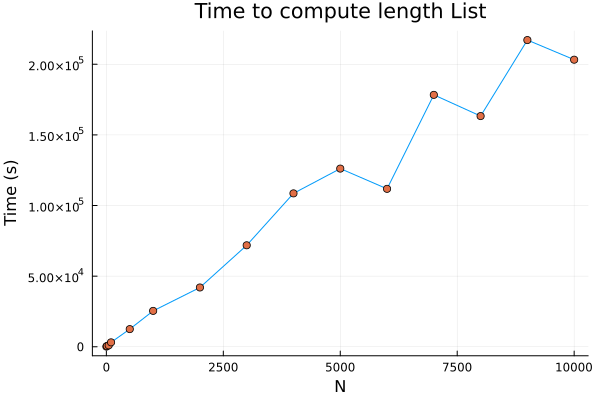
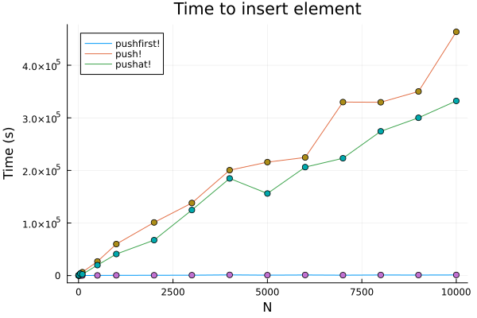
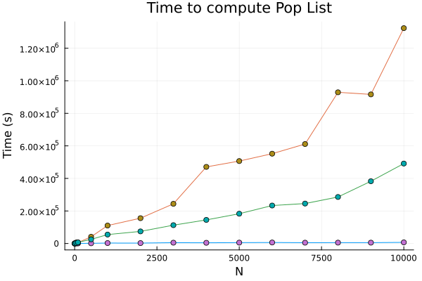

# What is a Linked List

A linked list is a structure used for storing a collection of data that has the following properties:

- Successive elements are connected with a pointer (*not necessarily contiguous memory*)
- The last element points to `nothing`
- They grow and shrink during the execution of the program (*mutable*)
- Can be made as long as required (memory bound)

# Abstract Data Type

## Main Operations
- **Insert**: insert an element to the list
- **Delete**: delete an element from the list

## Auxiliary Operations
- *Delete List*: delete the list and all its elements
- *Count*: give the length of the list
- *Find nth node from the end of the list*

# Difference with Array (SArray in Julia)

Array elements are **contoguous in memory** and can be accessed in constant time (given the pointer at the beginning and the length of each element, you just need to read `n*size(typeof(element))` and move the pointer)

## Advantages
- Read and Write element in O(1)
- Easy to use
- Deletion and insertion at ending is easy (if the array is not full)
## Disadvantages
- **Fixed size**: once the memory is allocated that's the size of the array
- **Block allocation**: need to find the space
- **Waste of space**: if you only use part of the array
- **Complex position based insetion**: If the array is smaller than its maximum size and I wand to insert or remove an element at a certain position, I need to move ALL the other elements coming after (expensive at worst O(N) if it's at the beginning)

# Difference with Dynamic Arrays (is it the impremelentation of Array in Julia? Not sure)
Also knows as **array lists**, they are similar to static arrays, but when one finishes, I can allocate a new chunck of memory and linking it. 

Something in between lists and arrays

# Linked Lists
## Advantages
- Can insert an element in O(1): 
   - Create a new element at new_ptr
   -  Get tmp -> old_ptr 
   -  Change olt_ptr-> new_ptr
   - Point my new object to new_ptr
- I can easily make a linked list of different elements
## Disagvantages
- Reaching any point except the beginning can take O(N) (thus for insertion I need to take that into account)

## Single Linked List

### Traverse: 

To traverse it I neeto to get all the elements in the list until I hit `Nothing` (see `ListLength`)
    
* Time Complexity: O(N) [to traverse while counting]
* Space Complexity: O(1) [to allocate counter]

### Insert Node:

#### Insert at the beginning (`pushfirst!`)
- Create new element `new_node`
- Make new_node point at `head`
- Substitute pointed to `head` to pointer to `new_node`

* Time Complexity: O(1)
* Space Complexity: O(1)

#### Insert at the end (`push!`)
- Create new element `new_node`
- Travel to the end (O(N))
- Modify last pointed to `nothing` -> `new_node`

* Time Complexity: O(N)
* Space Complexity: O(1)

#### Insert in the middle (`pushat!`)
- Create new element `new_node`
- Travel to `n-1` nodes 
- copy pointer of `n-1` in `tmp`
- change pointer of `n-1`->`new_pointer`
- Point new pointer to tmp

* Time Complexity: O(N)
* Space Complexity: O(1)

### Delete Node

### Delete at the beginning (`popfirst!`)
- new_head= next(head)
- list.head=new_head
- no need to get rid of the node: **garbage collection**

* Time Complexity: O(1)
* Space Complexity: O(1)

### Delete at the end (`pop!`)
- Create new element `new_node`
- Travel to the end-1 O(N)
- Set `end-1` node.next to `nothing
- garbage collection

* Time Complexity: O(N)
* Space Complexity: O(1)

### Delete in the middle
- Create new element `new_node`
- Travel to `i-1` node (up to O(N))
- set new_node.next-> i-1 node.next
- set i-2 node.next -> new_node

* Time Complexity: O(N)
* Space Complexity: O(1)

